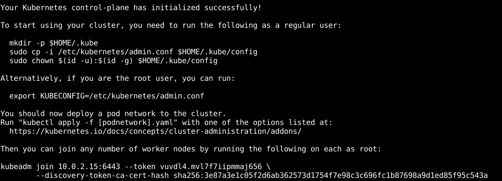
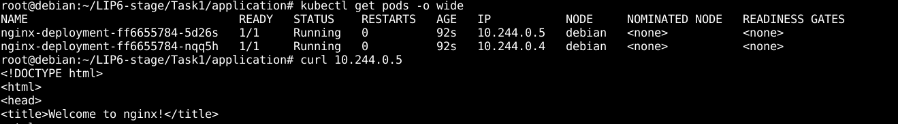

## Intégration de Kubernetes au sein de Namespaces

L'objectif de cette tâche était d'étudier la faisabilité de l'intégration de Kubernetes au sein d'un groupement de namespaces. Plusieurs scripts sont disponibles dans le répertoire `scripts/` et sont dédiés à cette étude de faisabilité.

### Installation de Kubernetes sur la machine virtuelle

Au LIP6, des machines virtuelles utilisant Debian version 9.12 Stretch et le noyau version 4.9.0-12-amd64 sont utilisées. La première étape a consisté à installer Kubernetes sur cette configuration spécifique, rendue possible par le script `install-kube.sh` :

```bash
./install-kube.sh
```

<p align="center">
  
</p>  

Le script vous proposera de déployer deux pods nginx pour vérifier le bon fonctionnement :

<p align="center">
  
</p>  

### Intégration de Kubernetes dans un groupement de namespaces

Après avoir installé Kubernetes avec succès sur la machine virtuelle, la phase suivante a consisté à le faire fonctionner au sein d'un groupement de namespaces. La liste des instructions à exécuter se trouve dans le fichier `master-ns.txt` et facilite la création de différents namespaces tout en assurant la connectivité entre l'hôte et le conteneur. Une fois les commandes exécutées sur l'hôte et dans les namespaces, la connectivité devrait être établie entre les deux.
