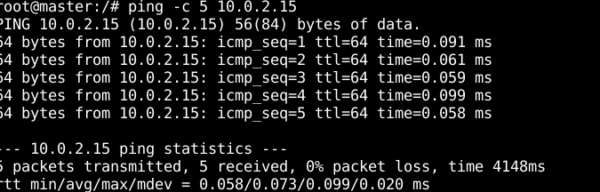

## Intégration de Kubernetes au sein de Namespaces

L'objectif de cette tâche était d'étudier la faisabilité de l'intégration de Kubernetes au sein d'un groupement de namespaces. Plusieurs scripts dédiés à cette étude de faisabilité sont disponibles dans le répertoire `scripts/`.

### Installation de Kubernetes sur la machine virtuelle

Au LIP6, des machines virtuelles utilisant Debian version 9.12 Stretch avec le noyau version 4.9.0-12-amd64 ont été utilisées. La première étape a consisté à installer Kubernetes sur cette configuration spécifique, grâce au script `install-kube.sh` :

```bash
./install-kube.sh
```

<p align="center">
  
</p>  

Le script vous proposera de déployer deux pods nginx pour vérifier le bon fonctionnement :

<p align="center">
  
</p>  

### Intégration de Kubernetes dans un groupement de namespaces

Après avoir installé Kubernetes avec succès sur la machine virtuelle, la phase suivante a consisté à le faire fonctionner au sein d'un groupement de namespaces. Les instructions nécessaires pour cette étape sont disponibles dans le fichier `master-ns.txt` et permettent la création de différents namespaces tout en assurant la connectivité entre l'hôte et le conteneur. Une fois les commandes exécutées sur l'hôte et dans les namespaces, la connectivité devrait être établie entre les deux.

<p align="center">
  
</p> 

Cependant, lors de la tentative de création d'un cluster dans le namespace avec Kubeadm, une erreur survient : "/proc/sys/net/bridge/bridge-nf-call-iptables does not exist". Cette erreur provient du fait que le module bridge netfilter n'est pas correctement isolé dans la version 4.9 du noyau. Cette situation a été rectifiée dans la version 5.3. Source : [Lien](https://git.kernel.org/pub/scm/linux/kernel/git/pablo/nf-next.git/commit/?id=ff6d090d0db41425aef0cfe5dc58bb3cc12514a2)

### Transition vers Debian 12 

Compte tenu du problème lié au module bridge netfilter pour cette version du noyau, nous avons décidé de passer à une version plus récente de Debian avant de procéder à la transition. Notre choix s'est porté sur Debian 12, qui embarque la version 6.1 du noyau.

L'installation des outils Kubernetes sur cette version a été réalisée en utilisant le script [Installing-Kubernetes](https://github.com/Ryadhmd/Installing-Kubernetes/tree/main) initialement développé pour un autre projet.


