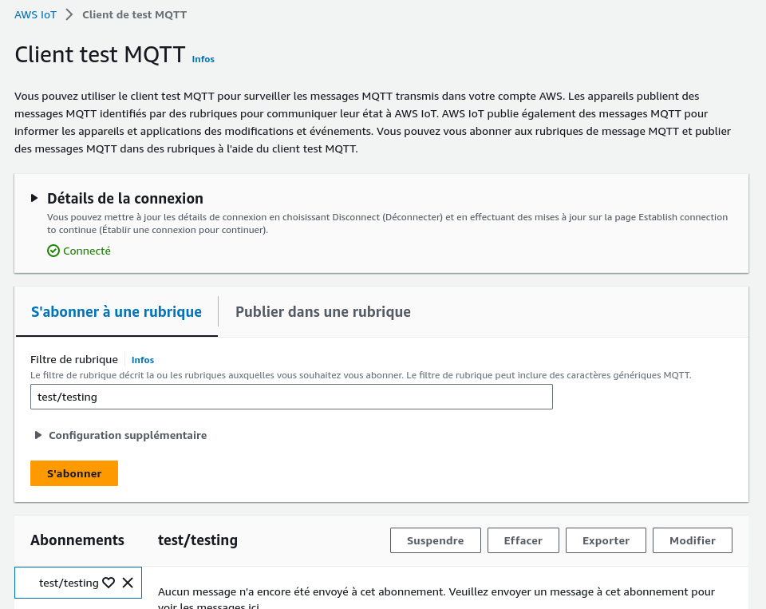
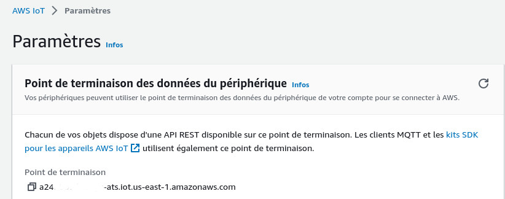
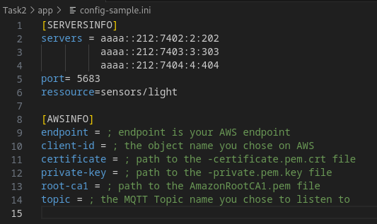
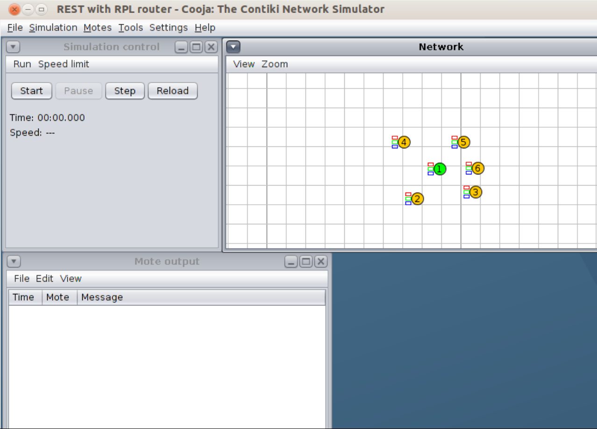

# AWS IoT Contiki

Le but de cette tâche est de récupérer des métriques depuis des objets IoT émulés par le simulateur Cooja fourni par Contiki-OS et de les publier sur le Cloud en utilisant AWS IoT.

## Installation d'Instant-Contiki

Instant-Contiki est une machine virtuelle pré-configurée avec tous les outils et logiciels nécessaires pour le développement sous ContikiOS.

### Téléchargement de la machine virtuelle

Vous pouvez télécharger la machine virtuelle à partir du lien suivant : [Télécharger Instant-Contiki 3.0](https://sourceforge.net/projects/contiki/files/Instant%20Contiki/Instant%20Contiki%203.0/)

La machine virtuelle est basée sur Ubuntu 14.04 LTS avec une version de noyau 3.13. La version de Python utilisée et prise en charge ici est la version 3.4.3.

### Configuration de la machine virtuelle

Après avoir téléchargé la machine virtuelle, extrayez le contenu en utilisant la commande suivante :

```bash
unzip InstantContiki3.0.zip
```

Ensuite, ouvrez le fichier .vmx avec VMware (ou tout autre logiciel de virtualisation) et lancez la machine virtuelle. 

**IMPORTANT:** Pour vous connecter à Instant Contiki, utilisez les informations suivantes :
- **Nom d'utilisateur:** user
- **Mot de passe:** user

N'oubliez pas de mettre à jour les paquets du système en exécutant les commandes suivantes dans le terminal de la machine virtuelle :

```bash
sudo apt update
sudo apt upgrade
```
## Récupération du code source

Pour commencer, clonez ce repository en utilisant la commande `git clone` :

```bash
git clone https://github.com/Ryadhmd/LIP6-stage.git
```

Ensuite, déplacez-vous dans le répertoire `LIP6-stage/Task2` à l'aide de la commande `cd` :

```bash
cd LIP6-stage/Task2
```

Créez ensuite un dossier nommé `aws-creds` à l'aide de la commande `mkdir` :

```bash
mkdir aws-creds
```
<!-- 
<p align="center">
   
</p>

<p align="center">
  
</p>

<p align="center">
  
</p> 

<p align="center">
  
</p> 

--> 
## Configuration d'AWS

Afin de pouvoir connecter les objets IoT à AWS IoT, certaines tâches de configuration sont nécessaires. Accédez à votre Console de Management AWS et recherchez le service "IoT Core" dans la barre de recherche ou trouvez-le dans la section "Internet of Things" (IoT).

### Étape 1 : Créer une politique de sécurité

Dans le menu de gauche, cliquez sur "Sécurité" puis sur "Stratégie", cliquez ensuite sur "Créer".

<p align="center">
   
</p>

1. Donnez un nom à votre politique, par exemple "PolitiqueContiki" ou "Contiki".

2. Dans la section "Action", sélectionnez les actions que vous souhaitez autoriser pour cette politique. Dans notre exemple, nous avons sélectionné `*` afin d'autoriser toutes les actions AWS IoT, ce qui est utile pour les tests. Cependant, il est préférable d'améliorer la sécurité pour une configuration en production. Pour des exemples de politiques plus sécurisées, consultez les [exemples de politiques AWS IoT](https://docs.aws.amazon.com/iot/latest/developerguide/example-iot-policies.html).

3. Dans la section "Ressource ARN", spécifiez les ressources auxquelles cette politique s'applique. Vous pouvez laisser l'option par défaut `*` pour appliquer la politique à toutes les ressources IoT.

4. Enfin, sous "Effet", choisissez "Autoriser" pour permettre les actions spécifiées par la politique.

### Étape 2 : Créer un objet IoT

Dans la console AWS IoT Core, dans le volet de navigation de gauche, choisissez "Gérer".

1. Sur la page "Création d'objets AWS IoT" (Creating AWS IoT things), choisissez "Créer un seul objet".

2. Sur la page "Spécifier les propriétés de l'objet", entrez un nom pour votre objet. Par exemple : Test-Thing. Des configurations supplémentaires sont possibles, mais nous allons nous restreindre au minimum.

3. Une fois sur la page "Configurer le certificat de l'appareil", choisissez "Génération automatique d'un nouveau certificat". Cela va générer un certificat, une clé publique et une clé privée à l'aide de l'autorité de certification d'AWS IoT.

4. Dans la rubrique "Attacher des stratégies aux certificats", sélectionnez la stratégie précédemment créée.

5. Une fenêtre "Télécharger les certificats et les clés" devrait s'afficher. Téléchargez les différents fichiers sous le dossier `aws-creds` précédemment créé. Nous aurons plus particulièrement besoin du Certificat d'appareil, du Fichier de clé privée et du Certificat d'autorité de certification "Amazon Root CA 1".

<p align="center">
  
</p>

### Étape 3 : Abonnement à une Rubrique MQTT 

Rendez-vous sur "Client test MQTT" d'AWS IoT et choisissez un nom de rubrique sur laquelle vous voulez recevoir les messages MQTT. Dans notre exemple, nous avons choisi "test/testing", mais vous pouvez la nommer comme vous le souhaitez.

<p align="center">
  
</p> 

### Étape 4 : Copier l'URL du point de terminaison 

Allez dans "Paramètres" d'AWS IoT sous "Point de terminaison des données du périphérique", copiez l'URL du "Point de terminaison". Cette URL est la porte d'entrée vers le Cloud et c'est à ce point de terminaison que le code se connectera pour accéder à AWS.

<p align="center">
  
</p> 

## Mise à jour du fichier de configuration

Pour configurer correctement votre application, vous devez fournir différentes informations dans un fichier `config.ini`. Un exemple de la structure de ce fichier est fourni sous le nom de `config-sample.ini`. Suivez ces étapes pour mettre à jour le fichier de configuration :

1. Renommez le fichier `config-sample.ini` en `config.ini` en utilisant la commande suivante dans le terminal :

```bash
mv config-sample.ini config.ini
```

2. Ouvrez le fichier `config.ini` à l'aide de l'éditeur de texte de votre choix. Par exemple, vous pouvez utiliser `gedit` en entrant la commande suivante dans le terminal :

```bash
gedit config.ini
```

3. Saisissez les informations de configuration requises dans le fichier `config.ini`. Ces informations peuvent inclure des paramètres spécifiques à votre application ou projet.

<p align="center">
  
</p> 

Dans la partie `SERVERSINFO` du fichier de configuration, assurez-vous que les adresses IP ainsi que la ressource demandée correspondent à la simulation que vous souhaitez lancer. Le fichier `config-sample.ini` est fourni avec des valeurs appropriées pour faire fonctionner la simulation "multiple-coap-servers", mais vous devez l'adapter en fonction de vos besoins spécifiques. 

Assurez-vous de sauvegarder les modifications après avoir saisi les informations de configuration. Le fichier `config.ini` est essentiel pour assurer le bon fonctionnement de votre application avec les paramètres appropriés.

## Lancer la simulation

Une fois le fichier de configuration édité, il est temps de lancer la simulation. Suivez ces étapes :

1. Rendez-vous dans le dossier `contiki/tools/cooja`.

2. Assurez-vous que tous les sous-modules Git sont à jour en utilisant la commande suivante dans le terminal :

```bash
git submodule update --init
```

3. Lancez la simulation en utilisant la commande suivante :

```bash
ant run
```

4. Attendez que Cooja se lance.

5. Sélectionnez "File" -> "Open simulation" -> "Browse" et recherchez le fichier "Task2/multiple-coap-servers.csc".

<p align="center">
  
</p> 

Assurez-vous que la simulation se charge correctement avec le fichier "multiple-coap-servers.csc" sélectionné.

6. Pour établir la connexion entre les deux réseaux, effectuez un clic droit sur la motte d'ID 1, puis allez dans `Mote tools for Sky1` et cliquez sur `Serial Socket(SERVER)`. Laissez le port par défaut et cliquez sur "Start".

7. Lancez la simulation en cliquant sur "Start" dans la fenêtre "Simulation Control".

8. Ouvrez maintenant un terminal et lancez :

```bash
sudo ~/contiki/tools/tunslip6 -a 127.0.0.1 -p 60001 aaaa::1/64
```

Tunslip est un outil utilisé pour faire le pont entre le trafic IP d'un hôte et un autre élément du réseau, généralement un routeur frontal (border router), via une liaison série. Tunslip crée une interface réseau virtuelle (tun) du côté de l'hôte et utilise SLIP (Serial Line Internet Protocol) pour encapsuler et faire passer le trafic IP vers et depuis l'autre extrémité de la liaison série. Cela permet d'établir la communication entre les différents éléments du réseau simulé.


